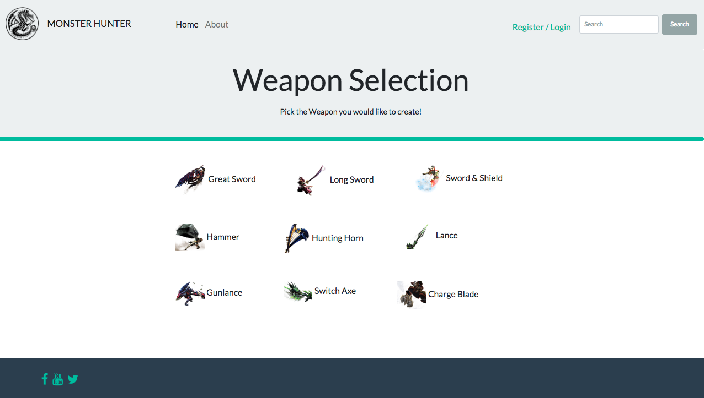
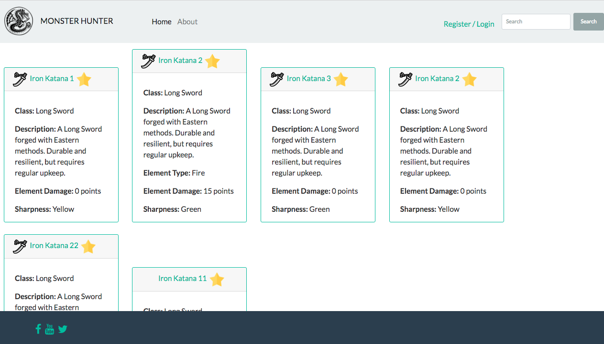
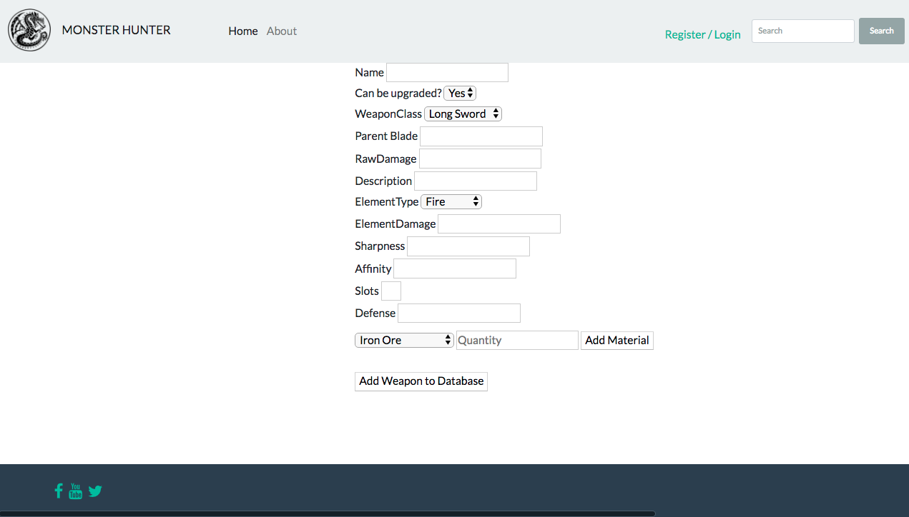

# Monster Hunter Web App

**Authors:** Andres Ibarra, Jeff Martinez, Zachary Johnson </br>
**Version:** 1.0.0 


## Overview
Players in the <i>Monster Hunter</i> games do extensive research on weapons and armor in order to figure out what is required to craft them. There are many different types of weapons and armory with different properties that make them more effective to different monsters. Monster Hunter Players need an easy way to compare different equipment, and then decide which one to pursue. This involves collecting items and crafting the pre-requisite equipment. 
This application allows the user to quickly find the item a player wants to craft, and build a list of all the components needed as well as where to find them to save time & research in game time.


## Getting Started
The following are required to run the program locally.
- [Visual Studio 2017 Community with .NET Core 2.0 SDK](https://www.microsoft.com/net/core#windowscmd)
- [GitBash / Terminal](https://git-scm.com/downloads) or [GitHub Extension for Visual Studio](https://visualstudio.github.com)

1. Clone the repository to your local machine.
2. Cd into the application directory where the `MonsterHunterAPI.sln` exist.
3. Open the application using `Open/Start MonsterHunterAPI.sln`.
4) Once the App is opened, Right click on the application name from the `Solution Explorer Window` and select `Add` -> `New Item` -> find `ASP.NET Configuration File` and open add it to the project.
- Inside this file, change the Connection String to the following to connect to database
```css
"ConnectionStrings": {
    "DefaultConnection": "Server=(localdb)\\MSSQLLocalDB;Database=TaskDB;Trusted_Connection=True;MultipleActiveResultSets=true"
}
```

5) Click `Tools` -> `NuGet Package Manager` -> `Package Manager Console` then run the following commands in the console.
```css
- Install-Package Microsoft.EntityFrameworkCore.Tools
- Add-Migration Initial
- Update-Database
```
6. Once the database is updated, you can Run the application by clicking on the Play button .

## Example




## Architecture
This application is created using ASP.NET Core 2.2 Web API applicaiton. </br>
**Language:** C# </br>
**Libraries & Frameworkds:** 
- Http Net
- Bootstrap
- JSON Linq
- XUnit
 </br>
 
**Type of Application:** MVC Application


## Change Log
01-22-2018 10:10am - Scaffold Front-End MVC Application </br>
01-22-2018 05:00pm - Deploy to Azure </br>
01-23-2018 10:00am - Create Controllers </br>
01-23-2018 1:00pm - Make call to backend API </br>
01-23-2018 3:00am - Create Objects on the API </br>
01-24-2018 4:00pm - Filtering mechanism based on user entry and testing</br>
01-25-2018 5:00pm - Finished UI and More tests </br> 
01-26-2018 10:00am - Final deploy to Azure for presentation

## License
Licensed under the MIT license.
